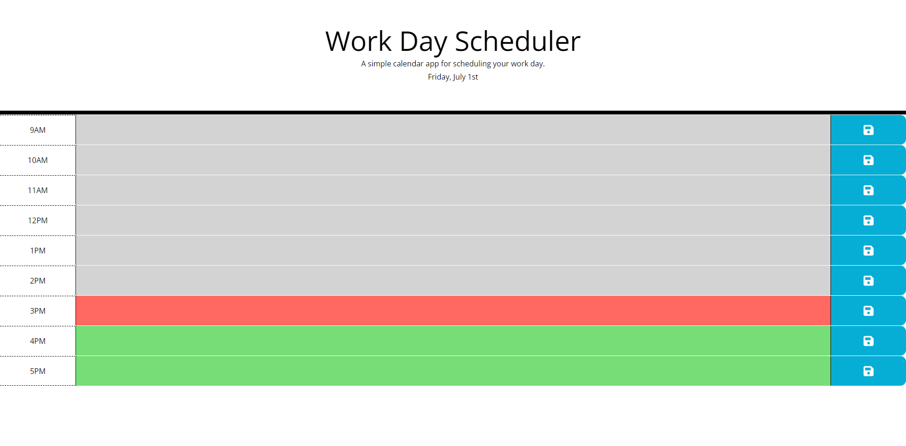

# work_day_scheduler

**Note:** This repo contains my source code for a work day scheduler created for Challenge 5 of GA Tech's 2022 Coding Bootcamp.

## Description ##

With our hectic lives wouldn't it be nice to have a simple, lightweight app to plan out your day? Look no further! This web app makes it possible to plan appointments on an hourly basis during the business hours of 9AM to 5PM. It even conveniently color codes the hours so you can easily keep track of the remaining time in the day. Keep in mind that after business hours but prior to midnight all blocks will be considered as "in the past" but at the stroke of midnight all blocks will be considered "in the future".

## Live Website ##

https://chromodyne.github.io/work_day_scheduler/

## Screenshot ##

